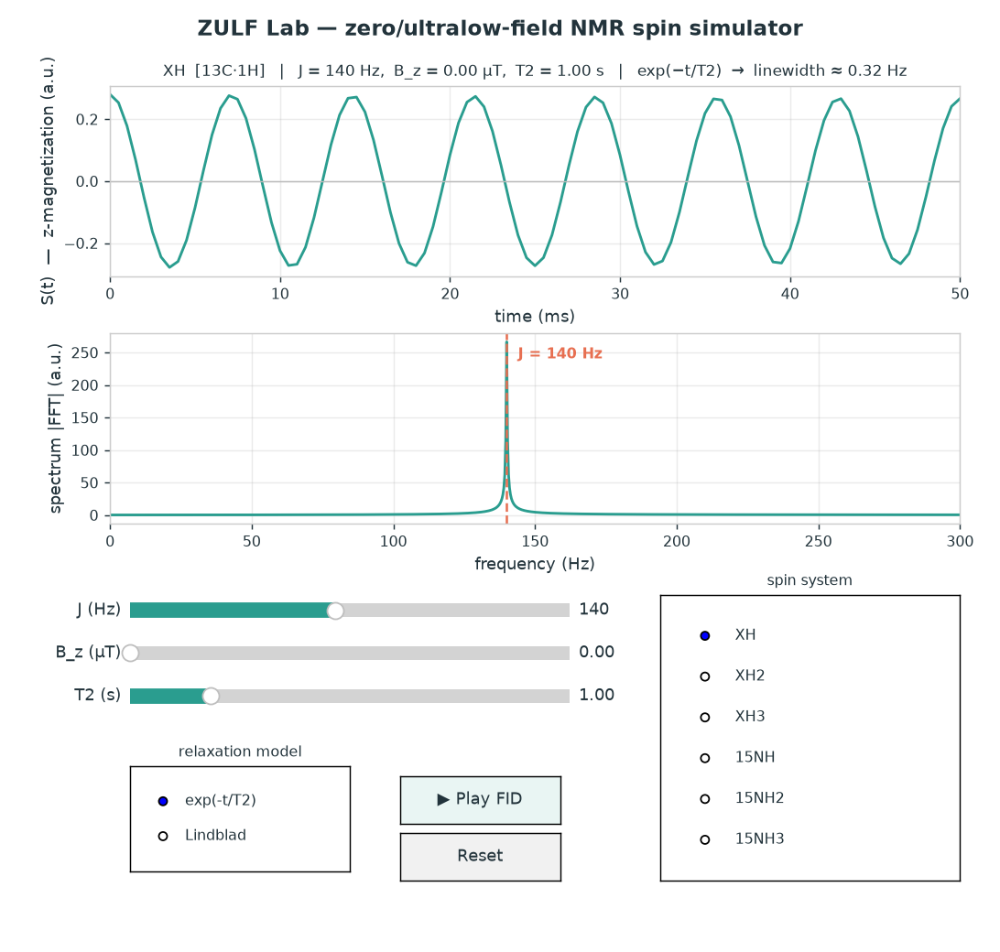

# ZULF Lab

An interactive **zero- to ultralow-field NMR spin simulator**, built from scratch
with NumPy/SciPy/Matplotlib (no qutip, no spin-dynamics libraries — the operators
and propagation are written by hand so the physics is explicit).

This is a scoped model of zero-field NMR (the kind detected with an atomic
magnetometer, as in the Budker/Pines/Blanchard work): at zero field there is no
Zeeman term, the coupled spins evolve under the scalar **J-coupling alone**, and the
detected magnetization oscillates at the J-coupling frequency. Drag a slider and
watch the spectrum reshape.

## Run

```bash
pip install numpy scipy matplotlib
python zulf_nmr.py
```

An interactive window opens with live sliders for **J**, **leading field B_z**, and
**T2**, a **spin-system selector**, a **relaxation-model toggle**, and a **Play**
button that animates the FID building up. A static snapshot of the default state is
always written to `zulf_demo.png` (so it also works headless).



### Spin systems

Two heteronuclear families, all ≤ 4 spins (Hilbert dimension ≤ 16): a **¹³C**
series (`XH`, `XH2`, `XH3`) and a **¹⁵N** series (`15NH`, `15NH2`, `15NH3`). They
share the same zero-field line pattern but behave differently in the ULF crossover
— ¹⁵N has a much smaller, *negative* gyromagnetic ratio, so its lines shift the
other way as B_z grows.

### Relaxation model (live toggle)

- **`exp(-t/T2)`** — fast phenomenological envelope; every line gets width ≈ 1/(πT2).
- **`Lindblad`** — a proper dissipative superoperator with independent transverse
  dephasing on each spin (collapse operators `√(2/T2)·Iᵢᶻ`). The Liouvillian is
  diagonalized once and the signal is summed over its damped eigenmodes, so
  linewidths *emerge from the model* and differ line-to-line (more dephasing spins
  ⇒ broader line). Instant for the 2–3 spin systems; ~75 ms/update for the 4-spin
  (dim-16) ones, since it diagonalizes a 256×256 matrix.

## Physics, in brief

- Units: frequencies in Hz, time in s, ħ = 1. Because J is in Hz and t in seconds,
  every Hamiltonian term carries a factor of **2π**, and `U(t) = exp(-i H t)`.
- `H = H_J + H_Z` with
  `H_J = 2π Σ_{i<j} J_ij (Ix_i Ix_j + Iy_i Iy_j + Iz_i Iz_j)` and
  `H_Z = -2π Σ_i ν_i I_i^z`, `ν_i = γ_i B_z`.
- Prepolarized initial state and detected observable are the γ-weighted z-spins:
  `ρ0 = M = Σ_i (γ_i/γ_H) I_i^z`.
- The signal is nonzero **only** because the system is heteronuclear (γ_H ≠ γ_C):
  if the γ's were equal, ρ0 ∝ total F_z, which commutes with H_J, and nothing would
  evolve.
- H is diagonalized once; `S(t) = Re Tr[ρ(t) M]` is then an exact sum of
  exponentials at the transition frequencies `(E_n − E_m)/2π`. A phenomenological
  `exp(-t/T2)` envelope gives Lorentzian lines of width ≈ `1/(πT2)`.

## Correctness test

At **B_z = 0 the spectral peak sits at exactly f = J** (within the ~0.33 Hz
resolution). If it lands at J/2π (off by ~6.28×), a factor of 2π is missing; if
there is no peak at all, the system isn't heteronuclear. The predicted zero-field
lines are XH → {J}, XH2 → {1.5 J}, XH3 → {J, 2J} (the classic methyl pair). These
checks print on every run.
