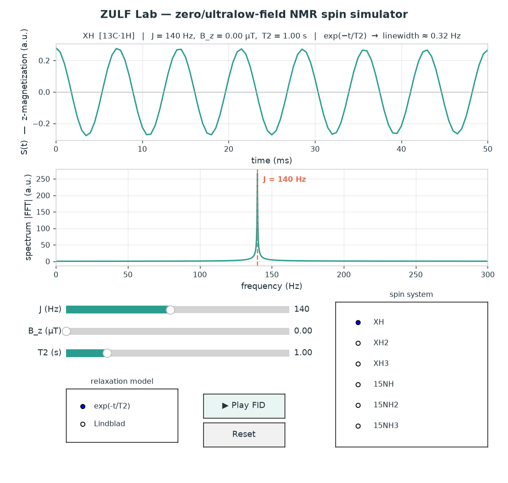
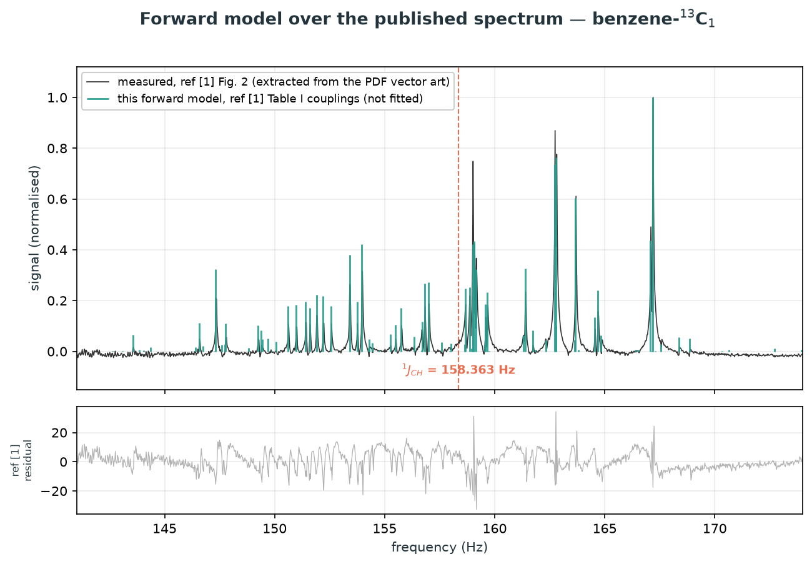
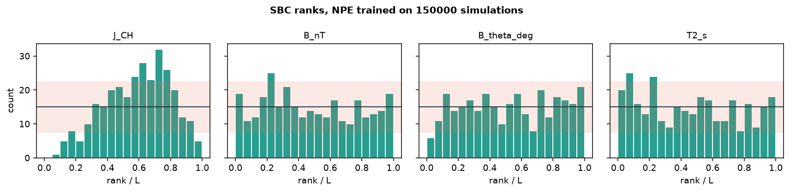

# ZULF Lab

An interactive **zero- to ultralow-field NMR spin simulator**, and the forward
model plus simulation-based-inference stack built on top of it.

## Install and run

```bash
pip install -r requirements.txt
pytest -q                    # 131 tests, all physics claims are encoded here

python zulf_nmr.py           # interactive teaching simulator
python zulf_forward.py       # forward-model smoke demo
python nested_reference.py   # exact-likelihood reference posterior
python methanol_demo.py      # four spins: a measured coupling and a flat one
python local_baseline.py     # the least-squares baseline, three cases
python resolution_cliffs.py  # where a peak-list summary jumps, and what it costs

python make_figure1.py       # model over a published spectrum
python make_figure2.py       # the posterior and its spread
python make_figure4.py       # vs exact sampling and vs a least-squares fit
```

Trained networks are cached under `models/` and reused across scripts, so the
figure scripts are cheap after the first run.

Everything is built from scratch with NumPy/SciPy/Matplotlib (no qutip, no
spin-dynamics libraries — the operators and propagation are written by hand so
the physics is explicit).

This is a scoped model of zero-field NMR (the kind detected with an atomic
magnetometer, as in the Budker/Pines/Blanchard work): at zero field there is no
Zeeman term, the coupled spins evolve under the scalar **J-coupling alone**, and the
detected magnetization oscillates at the J-coupling frequency. Drag a slider and
watch the spectrum reshape.

## `zulf_nmr.py` — the interactive simulator

An interactive window opens with live sliders for **J**, **leading field B_z**, and
**T2**, a **spin-system selector**, a **relaxation-model toggle**, and a **Play**
button that animates the FID building up. A static snapshot of the default state is
always written to `zulf_demo.png` (so it also works headless).



### Spin systems

Two heteronuclear families, all ≤ 4 spins (Hilbert dimension ≤ 16): a **¹³C**
series (`XH`, `XH2`, `XH3`) and a **¹⁵N** series (`15NH`, `15NH2`, `15NH3`). They
share the same zero-field line pattern but behave differently in the ULF crossover
— ¹⁵N has a much smaller, *negative* gyromagnetic ratio, so its lines shift the
other way as B_z grows.

### Relaxation model (live toggle)

- **`exp(-t/T2)`** — fast phenomenological envelope; every line gets width ≈ 1/(πT2).
- **`Lindblad`** — a proper dissipative superoperator with independent transverse
  dephasing on each spin (collapse operators `√(2/T2)·Iᵢᶻ`). The Liouvillian is
  diagonalized once and the signal is summed over its damped eigenmodes, so
  linewidths *emerge from the model* and differ line-to-line (more dephasing spins
  ⇒ broader line). Instant for the 2–3 spin systems; ~75 ms/update for the 4-spin
  (dim-16) ones, since it diagonalizes a 256×256 matrix.

## Physics, in brief

- Units: frequencies in Hz, time in s, ħ = 1. Because J is in Hz and t in seconds,
  every Hamiltonian term carries a factor of **2π**, and `U(t) = exp(-i H t)`.
- `H = H_J + H_Z` with
  `H_J = 2π Σ_{i<j} J_ij (Ix_i Ix_j + Iy_i Iy_j + Iz_i Iz_j)` and
  `H_Z = -2π Σ_i ν_i I_i^z`, `ν_i = γ_i B_z`.
- Prepolarized initial state and detected observable are the γ-weighted z-spins:
  `ρ0 = M = Σ_i (γ_i/γ_H) I_i^z`.
- The signal is nonzero **only** because the system is heteronuclear (γ_H ≠ γ_C):
  if the γ's were equal, ρ0 ∝ total F_z, which commutes with H_J, and nothing would
  evolve.
- H is diagonalized once; `S(t) = Re Tr[ρ(t) M]` is then an exact sum of
  exponentials at the transition frequencies `(E_n − E_m)/2π`. A phenomenological
  `exp(-t/T2)` envelope gives Lorentzian lines of width ≈ `1/(πT2)`.

## `zulf_forward.py` — the inference forward model

`zulf_nmr.py` is the interactive teaching demo. `zulf_forward.py` is the
simulation engine for the simulation-based-inference project: no UI, built for
speed and generality.

```bash
python zulf_forward.py          # smoke demo over the molecule presets
pytest -q test_forward.py       # 32 validation tests
```

- **Line lists, not time grids.** One diagonalization gives exact (frequency,
  complex amplitude) pairs — the summary statistic the network needs, and ~240×
  faster than building an FID and FFT-ing it. **0.204 ms** for a four-spin
  spectrum; 10⁵ spectra in **21 s**.
- **Vector field.** `field_vector(|B|, θ)` — two parameters, since only the
  magnitude and the angle to the sensor axis matter. A longitudinal field shifts
  the line by 2.3×10⁻⁶ Hz at 1 nT; a transverse one restructures the spectrum at
  the 10-mHz scale.
- **General J matrix.** Any topology, not just X coupled to equivalent protons.
  Includes benzene-¹³C₁ (7 spins, ref [1]'s benchmark with its fitted couplings).
- **General ρ(0).** All three protocols: `rho_thermal` (sudden drop),
  `rho_adiabatic` (level-following, exact in the adiabatic limit and validated
  against an explicit ramp), and pulses in both the ref [1] hard-pulse and
  ref [14] finite-field conventions.
- **Detector response.** The 150 Hz sensor pole *and* the documented 6th-order
  500 Hz hardware low-pass, which is nearly flat in amplitude below 300 Hz but
  contributes ≈ −67° of differential phase across the J/2J band.

### Validated against the literature

Every test in `test_forward.py` encodes a published fact. Line positions
ν = J(I_A + ½) are confirmed three ways — Butler Eq. (40), Stern & Sheberstov's
odd/even rule, and Theis Eq. (1)–(2) — giving XA → J, XA₂ → 3/2 J, XA₃ → J & 2J
(the last two measured in refs [6] and [13]). Also encoded: the ΔI_A = 0
selection rule that makes J_HH invisible inside an equivalent group, the global
sign-flip and equal-γ permutation degeneracies, the transverse-field doublet
split by the *sum* of the Larmor frequencies with a line at their *mean*
(ref [13]), and the negative pulse-acquire weights at π/2 and π proton angles.

## Figure 1 — the model over a published spectrum

```bash
python make_figure1.py          # writes figure1_model_over_published.png
```



The measured benzene-¹³C₁ spectrum of ref [1] (Fig. 2) is recovered **exactly**
from the published PDF — the plot is vector art, so the trace is an 8515-point
polyline in the content stream, not a bitmap. No digitizing, no screenshot. The
axis is calibrated from the figure's own ticks (major every 127.746 pt, `160`
label at x = 521.135, minor every 25.549 pt = 1 Hz), giving
`f = 160 + (x − 521.135)/25.5492`.

The overlay is our forward model with ref [1]'s **own fitted couplings** and
**their preparation** (thermal polarization, then an instantaneous π pulse on
¹³C perpendicular to it, their Eq. 2). Nothing is fitted: the line positions are
a prediction from published numbers.

**Result.** Of 34 measured peaks above 5% of max, the 13 strongest sit a mean
−22.6 mHz from the nearest predicted line with a scatter of only **7.2 mHz**.
The offset is *uniform*, which is the signature of an axis-anchor offset rather
than a physics error — a residual field would shift lines differentially, and
0.58 pt out of 25.5 pt/Hz accounts for it, with the anchor inferred from a
left-anchored text label. So the forward model reproduces a real 7-spin
published multiplet to ~7 mHz RMS.

**Anchor, not scale.** A wrong anchor shifts every line equally; a wrong scale
stretches them across the span. Regressing offset against frequency gives a
slope of +0.26 ± 0.84 mHz/Hz (p = 0.76) over the 33 Hz window — no trend. The
scale is independently fixed by the tick spacing to better than 0.03%, so the
residual really is a constant anchor offset.

### Which published figures are extractable

Recovering a trace only works where the plot is vector art. Of the papers here:
**ref [1]** (all five molecules, pages 3–7), **ref [13]**, **ref [16]** and
**ref [7]** are vector; **ref [3]** (aromatics) and **ref [6]** (the XAₙ
spectra) are rasters and cannot be recovered this way. Ref [13]'s traces are
vector but its tick labels use a subsetted font with no usable ToUnicode map,
so its axis is not cheaply calibrated — though its text already states the
result that matters (a doublet about J split by the *sum* of the Larmor
frequencies).

## `zulf_infer.py` — priors, peak-list summaries, NPE

```bash
python zulf_infer.py            # trains a single-round NPE on [13C]-formic acid
pytest -q test_infer.py         # 26 tests
```

Parameters are `(J, |B|, θ_B, T2)`. The coupling prior is a few Hz wide rather
than the full band, since DFT/ML predictors already fix ¹J_CH to ~1 Hz; the
nuisances get deliberately wide priors. The observation is a fixed-length
(frequency, amplitude, width) summary — a low-frequency Larmor group and a
high-frequency J multiplet, with multiplet positions as offsets from the prior
centre. Lines closer than a linewidth are merged, as a real spectrometer would.

Because the forward model is deterministic with additive Gaussian noise, the
likelihood is available in closed form, so NPE samples can be reweighted into an
exact posterior — the case for SBI here is global search and multimodality, not
intractability.

### First result (simulated data, [¹³C]-formic acid, 50k simulations)

| | J, 95% width | shrinkage |
|---|---|---|
| prior | 6000 mHz | — |
| raw NPE | 11.4 mHz | 528× |
| **after importance reweighting** | **2.18 mHz** | **2750×** |
| information floor (3 lines at σ_f = 1 mHz) | 2.26 mHz | — |

Reweighting reaches the information floor, and the nuisances are recovered
(B_θ = 54.97° against a true 55°). **Sample efficiency is 1.7%**, above the 1%
floor but not by much — the raw NPE proposal is ~5× wider than the true
posterior, so most samples land in the wings. This is the perfectly-specified
simulated case; real data will only lower it, so a tighter proposal is worth
having before then.

> These numbers are conditional on σ_f, the peak-position measurement error,
> which here stands in for the whole acquisition and SNR chain rather than being
> derived from a simulated FID.

### Calibration, efficiency and an independent reference

```bash
python sigma_f_study.py      # what peak-position precision is actually achievable
python tighten_proposal.py   # compare NPE configurations
python nested_reference.py   # exact-likelihood reference posterior
python final_check.py        # SBC + efficiency spread on the tightened network
```

**σ_f is measured, not assumed.** Across T2 = 3–30 s and SNR = 30–300,
σ_f ≈ FWHM/(1.3 × SNR). The 1 mHz the inference work assumed corresponds to only
SNR ≈ 24 at T2 = 10 s, so it was *conservative*. (Idealised: one isolated line,
correct lineshape, flat baseline.)

**Tightening the proposal.** 150k simulations halve the raw NPE width
(11.1 → 5.8 mHz) and lift efficiency from 12% to 30%. A wider flow gave the
tightest proposal (2.3× floor) but the *worst* efficiency (9%) — efficiency does
not track width alone, since a narrow but mis-centred proposal produces extreme
weights.

**Reweighted precision is invariant.** ~2.24 mHz across every configuration
tried, including one deliberately undertrained network whose raw proposal was as
wide as the prior. Precision comes from the exact likelihood; the proposal only
sets efficiency.

**SBC says the network is conservative, not overconfident.** On J the ranks are
depleted at the edges (outer 20% holds 0.040 of the mass against 0.20 expected,
−6.9σ) and mildly heavy in the centre — the signature of a posterior that is too
*wide*. B_θ and T2 are calibrated. Too-wide is the safe direction, and it is
precisely why importance reweighting has good coverage.



**Efficiency varies 40× between observations** — 1.38% to 55.67% over 40 draws
from the prior, median 23.4%, none below 1%. This matters for the project's
failure criterion, which is stated as a single number: the same network on the
same model can read 1.4% on one spectrum and 55% on another. Quoting it over
several spectra, or with its spread, would be more robust than a single reading.

**Against nested sampling on the exact likelihood**, on the same observation:

| | J 95% width |
|---|---|
| nested sampling (reference) | 2.28 mHz |
| reweighted NPE | 2.27 mHz |
| agreement | **0.4%** |

Earlier, at 1.7% efficiency, the same comparison agreed only to 4%. At ESS ≈ 340
the reweighted quantiles carry ~5% Monte Carlo error, so **low efficiency
degrades the accuracy of the reweighted estimate, not just its speed.**

### A third exact degeneracy

θ_B and 180° − θ_B give bit-identical spectra: R_x(π) maps **B** = (Bx, 0, Bz) to
(Bx, 0, −Bz) and sends both ρ(0) = M and M to −M, leaving S(t) = Tr[ρ(t)M]
unchanged, so only |cos θ_B| is identifiable. This sits alongside the global sign
flip and the equal-γ permutations, and is broken here by capping the prior at
90°. Before that cap the angle posterior was bimodal at 55° and 125° with a mean
of 90° — a posterior mean over a symmetric two-peaked distribution, which is a
number with no meaning.

## Correctness test

At **B_z = 0 the spectral peak sits at exactly f = J** (within the ~0.33 Hz
resolution). If it lands at J/2π (off by ~6.28×), a factor of 2π is missing; if
there is no peak at all, the system isn't heteronuclear. The predicted zero-field
lines are XH → {J}, XH2 → {1.5 J}, XH3 → {J, 2J} (the classic methyl pair). These
checks print on every run.
